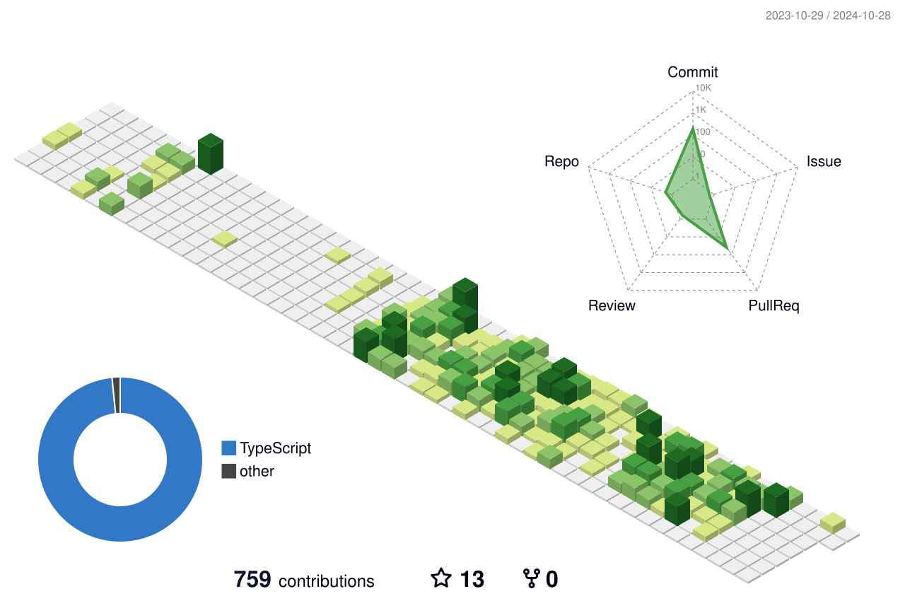

<h1 align="center">SAVE! SAVE!</h1>

  Hi, I'm Boneco Sinforoso, AKA Ícaro! :wink:  
  <i>Game developer, designer, and tech enthusiast</i>

  

<h1 align="center">📊 GitHub Stats</h1>

  

<h1 align="center">🔥 GitHub Streak</h1>

  

<h1 align="center">🏆 GitHub Trophies</h1>

  

<h1 align="center">🔗 Connect with me</h1>

  
  

<h1 align="center">🛠️ Languages and Tools</h1>

  
  
  
  
  
  
  

<h1 align="center">🌍 3D Contributions</h1>

  

<h1 align="center">🐍 Contribution Snake</h1>
<picture align="center">
  <source media="(prefers-color-scheme: dark)" srcset="https://raw.githubusercontent.com/BonecoSinforoso/BonecoSinforoso/output/github-contribution-grid-snake-dark.svg">
  <source media="(prefers-color-scheme: light)" srcset="https://raw.githubusercontent.com/BonecoSinforoso/BonecoSinforoso/output/github-contribution-grid-snake.svg">
  
</picture>

<h1 align="center">📈 Activity Graph</h1>

  

